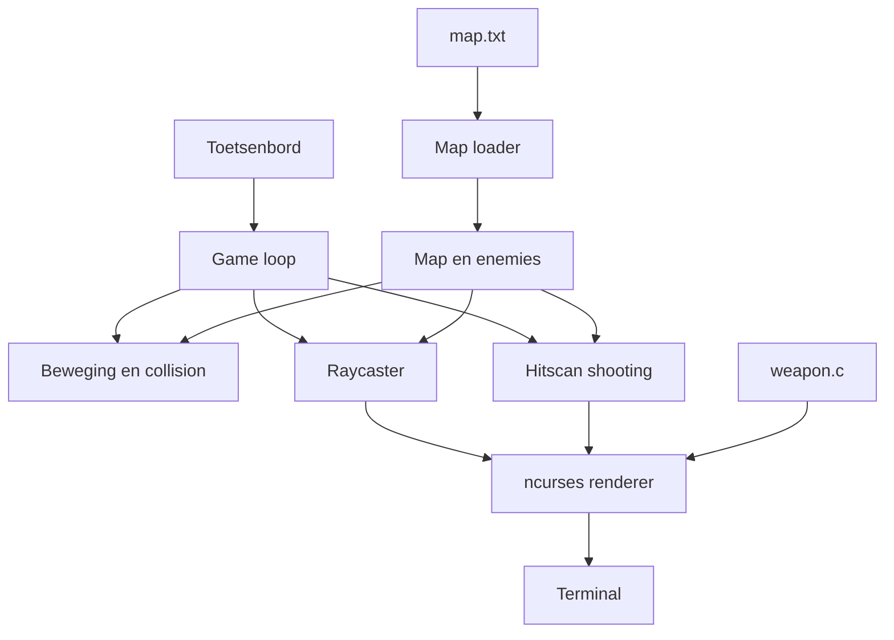

# Wolfenstein 3D-stijl terminalrenderer

Een educatief raycasting-spel in C dat volledig in een terminal draait. Het project gebruikt `ncurses` voor invoer, kleur en uitvoer. De speler kan door een kaart bewegen, draaien en met een hitscan-wapen op vijanden schieten.

> Dit is een zelfstandig oefenproject en geen officieel Wolfenstein-product. Het project gebruikt geen originele broncode, afbeeldingen, geluiden of levels uit Wolfenstein.

## Projectstatus

| Onderdeel | Waarde |
|---|---|
| Status | Werkend prototype |
| Programmeertaal | C11 |
| Interface | Terminal met ncurses |
| Platform | Lokale Linux/POSIX-terminal |
| Opslag | Tekstbestand voor de kaart |
| Netwerk | Geen |
| Database | Geen |
| Ontwikkelvorm | Incrementeel |

## Doel en context

Het doel is om de basisprincipes achter vroege 3D-games te onderzoeken zonder een grafische engine te gebruiken. Het project laat zien hoe een tweedimensionale kaart met raycasting kan worden omgezet naar een perspectivisch beeld.

De belangrijkste leerdoelen zijn:

- C-syntax en -semantiek toepassen;
- werken met structs, enums, arrays, pointers en functies;
- een DDA-raycastingalgoritme implementeren;
- terminalinvoer en -uitvoer verwerken met ncurses;
- kaartgegevens omzetten naar runtime-objecten;
- collision detection, projectie en hitscan-schieten toepassen;
- code opdelen in bron- en headerbestanden;
- iteratief ontwikkelen en wijzigingen beheren met Git.

## Functionaliteit

- Eerste-persoons raycastingweergave.
- Afstandsschaduw met zestien grijstinten.
- Alternatieve standaardkleuren wanneer de terminal geen aangepaste kleuren ondersteunt.
- Collision detection tegen muren.
- Vijanden die vanuit kaartgegevens worden geladen.
- Projectie van vijanden met occlusion door muren.
- Hitscan-schieten met munitie, schade, kills en score.
- ASCII-wapen met recoil en muzzle flash.
- HUD met munitie, score, aantal vijanden en spelerpositie.
- Automatische aanpassing aan de terminalafmetingen.

## Eisen en acceptatiecriteria

### Functionele eisen

| Eis | Acceptatiecriterium | Status |
|---|---|---|
| Kaart laden | Een geldige kaart bevat zestien regels van zestien tekens en ten minste één speler | Gerealiseerd |
| Bewegen | De speler kan vooruit en achteruit zonder door muren te lopen | Gerealiseerd |
| Draaien | De speler kan linksom en rechtsom draaien | Gerealiseerd |
| 3D-weergave | Iedere terminalkolom wordt door één ray gerenderd | Gerealiseerd |
| Schieten | Een schot verbruikt munitie en raakt alleen een vijand voor de speler | Gerealiseerd |
| Occlusion | Een vijand achter een muur kan niet geraakt of zichtbaar gerenderd worden | Gerealiseerd |
| Vijanden verslaan | Een vijand verdwijnt nadat diens gezondheid nul bereikt | Gerealiseerd |
| Afsluiten | De applicatie sluit af met `Q` of `Esc` | Gerealiseerd |

### Niet-functionele eisen

| Eis | Uitwerking |
|---|---|
| Compileerbaarheid | C11 met `-Wall -Wextra -Wpedantic` |
| Responsiviteit | De invoerlus gebruikt een timeout van 16 ms |
| Leesbaarheid | Configuratie, gedeelde types en wapencode zijn gescheiden |
| Compatibiliteit | Werkt met ncurses en heeft een kleurfallback |
| Veilig bestandsgebruik | De mapinvoer heeft een maximale invoerlengte en vaste grenzen |
| Offline gebruik | Geen account, internetverbinding of externe API nodig |

## Benodigdheden

- Een C11-compiler, bijvoorbeeld GCC of Clang.
- De ontwikkelheaders en bibliotheek van `ncursesw`.
- Een terminal met een minimale grootte van 20 kolommen bij 10 regels.
- Bij voorkeur een terminal met 256-kleurenondersteuning.

Voor Arch Linux zijn GCC en ncurses beschikbaar via:

```bash
sudo pacman -S gcc ncurses
```

## Bouwen en starten

Het buildscript compileert en start het programma:

```bash
chmod +x build.sh
./build.sh
```

Handmatig compileren kan met:

```bash
gcc -std=c11 -Wall -Wextra -Wpedantic main.c weapon.c -o main -lncursesw -lm
./main
```

Het programma verwacht dat `map.txt` vanuit de huidige werkmap beschikbaar is.

## Besturing

| Actie | Toetsen |
|---|---|
| Vooruit | `W` of pijltje omhoog |
| Achteruit | `S` of pijltje omlaag |
| Links draaien | `A` of pijltje links |
| Rechts draaien | `D` of pijltje rechts |
| Schieten | `Spatie` of `F` |
| Afsluiten | `Q` of `Esc` |

## Kaartformaat

De kaart staat in `map.txt` en bestaat uit een raster van 16 bij 16 tekens.

| Teken | Betekenis |
|---|---|
| `#` | Muur |
| `.` | Lege ruimte |
| `P` | Startpositie van de speler |
| `E` | Startpositie van een vijand |

Tijdens het laden worden `P` en `E` omgezet naar runtimegegevens. De tekens worden daarna vervangen door lege ruimte. Dit is een voorbeeld van het omzetten van een tekstuele gegevensverzameling naar structs en arrays die de game kan gebruiken.

Een onleesbaar bestand, een regel met een verkeerde lengte, te veel vijanden of een ontbrekende speler zorgt ervoor dat het programma niet start.

## Projectstructuur

```text
.
├── build.sh          # Compileren en starten
├── game_config.h     # Benoemde instellingen en kleur-ID's
├── game_types.h      # Gedeelde structs en enums
├── main.c            # Laden, raycasting, enemies, combat en game loop
├── map.txt           # Kaartgegevens
├── weapon.c          # ASCII-wapen en animatie
└── weapon.h          # Publieke weapon-functie
```

### Verantwoordelijkheden

- `main.c` beheert de applicatie, ncurses, kaart, raycasting, vijanden en invoer.
- `game_config.h` groepeert instellingen per onderwerp: map, combat, renderer en kleuren.
- `game_types.h` bevat gedeelde datatypes zoals `Vec2`, `Enemy`, `RayHit` en `ShotResult`.
- `weapon.c` bevat uitsluitend de presentatie en animatie van het wapen.
- `map.txt` bevat gegevens en geen programmalogica.

## Architectuurdiagram



## Sequentiediagram van een schot

```mermaid
sequenceDiagram
    actor Speler
    participant Loop as Game loop
    participant Shoot as Shoot
    participant Ray as CastRay
    participant Enemy as Enemy-data
    participant Render as Renderer

    Speler->>Loop: Spatie of F
    Loop->>Loop: Controleer cooldown en munitie
    Loop->>Shoot: Shoot(player, direction)
    Shoot->>Ray: Zoek afstand tot eerste muur
    Ray-->>Shoot: RayHit
    Shoot->>Enemy: Zoek eerste vijand vóór de muur
    Enemy-->>Shoot: Hit, kill of miss
    Shoot-->>Loop: ShotResult
    Loop->>Render: Update HUD, marker en recoil
```

Een ERD is niet van toepassing omdat het project geen relationele database of persistente entiteiten gebruikt.

## Belangrijke ontwerpkeuzes

### C en procedurele opbouw

Het project gebruikt C11 en een procedurele architectuur. Structs groeperen gegevens, headers beschrijven gedeelde interfaces en bronbestanden scheiden verantwoordelijkheden.

Dit project is geen volledige demonstratie van objectgeoriënteerd programmeren. Encapsulation en modularity worden gedeeltelijk toegepast via modules en interne data. Inheritance en polymorphism worden niet toegepast, omdat die niet natuurlijk bij deze kleine C-codebase passen.

### Raycasting

De renderer gebruikt DDA-raycasting. Voor iedere kolom wordt bepaald welke muur als eerste geraakt wordt. De afstand bepaalt vervolgens de geprojecteerde hoogte en kleur van de muur.

Dezelfde `CastRay`-functie wordt gebruikt voor rendering en voor controle of een vijand achter een muur staat. Hierdoor staat het algoritme niet dubbel in de code.

### Hitscan in plaats van projectielen

Schoten worden onmiddellijk berekend. Er bestaan geen rondvliegende kogels. Deze keuze past bij vroege first-person shooters en houdt de game loop klein.

### Vaste kaartgrootte

Een vaste kaart van 16 bij 16 maakt validatie en geheugenbeheer eenvoudig. Het nadeel is dat grotere of dynamische levels nog niet worden ondersteund.

### Geen cloud of netwerk

Dit is een native terminalapplicatie. SaaS, PaaS en IaaS leveren voor deze lokale singleplayergame geen functionele meerwaarde. Een cloudomgeving zou wel kunnen worden gebruikt voor CI-builds, releases of distributie, maar niet voor de runtime van het spel.

## Ontwikkelmethodiek

Het project wordt incrementeel ontwikkeld. Een werkende basis blijft bruikbaar terwijl functies in kleine stappen worden toegevoegd.

De globale ontwikkelvolgorde is:

1. Kaart laden en spelerpositie bepalen.
2. DDA-raycasting en terminalweergave maken.
3. Beweging en collision detection toevoegen.
4. Afstandsschaduw en terminalkleuren toevoegen.
5. Code opdelen in configuratie, types en wapencode.
6. Vijanden, hitscan-schieten, score en munitie toevoegen.
7. Presentatie, foutafhandeling en documentatie verbeteren.

Voor toekomstige iteraties kunnen taken als GitHub Issues worden vastgelegd met een acceptatiecriterium en een duidelijke definitie van gereed.

## Versiebeheer

Het project gebruikt Git en heeft een GitHub-remote. Een geschikte workflow is:

1. Maak een issue of kleine taak met een duidelijk resultaat.
2. Maak eventueel een featurebranch.
3. Houd commits klein en geef iedere commit een beschrijvende boodschap.
4. Compileer en test vóór het committen.
5. Gebruik een pull request wanneer een tweede persoon een wijziging kan beoordelen.
6. Gebruik tags voor stabiele versies.

Buildproducten zoals het uitvoerbare bestand `main` horen niet in Git en staan daarom in `.gitignore`.

## Gebruikte ontwikkeltools

- GCC voor compilatie.
- ncursesw voor terminalinvoer, kleuren en rendering.
- Git voor lokaal versiebeheer.
- GitHub voor opslag en samenwerking.
- Shellscript voor een herhaalbare lokale build.
- AI als hulpmiddel bij brainstormen, uitleg, documentatie en refactoring.

### Verantwoord gebruik van AI

AI-uitvoer wordt niet automatisch als correct beschouwd. Gegenereerde voorstellen moeten handmatig worden gelezen, aangepast, gecompileerd en getest. De ontwikkelaar blijft verantwoordelijk voor de werking, veiligheid, auteursrechten en begrijpelijkheid van de ingeleverde code.

Er worden geen wachtwoorden, persoonsgegevens, tokens of andere vertrouwelijke gegevens in AI-prompts geplaatst. Bij een opleiding of organisatie moet daarnaast het geldende AI-beleid worden gevolgd.

## Teststrategie

### Huidige situatie

Het project wordt momenteel handmatig getest en met strenge compilerwaarschuwingen gebouwd. Er is nog geen geautomatiseerde testsuite of CI-pipeline. Dat is een bekende kwaliteitsbeperking en wordt niet verborgen.

### Handmatige controles

- Het programma start met een geldige kaart.
- Een ontbrekende of ongeldige kaart wordt geweigerd.
- De speler loopt niet door muren.
- Draaien werkt in beide richtingen.
- De renderer blijft werken na het vergroten of verkleinen van de terminal.
- Een schot verlaagt de hoeveelheid munitie.
- Een muur blokkeert een schot.
- Een vijand ontvangt schade en kan worden uitgeschakeld.
- Score en het aantal levende vijanden worden bijgewerkt.
- De applicatie herstelt de terminal na afsluiten.

### Aanbevolen automatische tests

- Mapvalidatie en conversie van `P` en `E`.
- Collision detection aan iedere kaartrand.
- Afstanden en zijden die `CastRay` teruggeeft.
- Hits, misses, wall occlusion en kills.
- Gedrag bij nul munitie.
- Bouwen met GCC en Clang.
- Uitvoeren met AddressSanitizer en UndefinedBehaviorSanitizer.

Een toekomstige GitHub Actions-workflow kan bij iedere push compileren en tests uitvoeren.

## Security en SSDLC

De applicatie heeft een klein aanvalsoppervlak: zij verwerkt alleen lokale toetsenbordinvoer en één lokaal tekstbestand. Zij opent geen netwerkverbinding, voert geen ingevoerde commando’s uit en verwerkt geen accounts.

Toegepaste maatregelen:

- mapregels worden begrensd ingelezen;
- kaartafmetingen worden gecontroleerd;
- het maximale aantal vijanden wordt gecontroleerd;
- kaarttoegang wordt begrensd;
- het programma draait zonder verhoogde rechten;
- compilerwaarschuwingen staan aan;
- er worden geen secrets in de repository verwacht.

Resterende verbeteringen:

- geautomatiseerde tests toevoegen;
- sanitizers en static analysis gebruiken;
- fouten van alle ncurses-functies controleren;
- dependencyversies en kwetsbaarheden periodiek controleren;
- fuzztests voor het kaartformaat toevoegen.

OWASP-richtlijnen voor webapplicaties zijn grotendeels niet van toepassing omdat dit geen webapplicatie is. De algemene SSDLC-principes blijven wel relevant: requirements vastleggen, invoer valideren, dependencies beheren, testen, reviewen en kwetsbaarheden opvolgen.

## Privacy

Het programma verwerkt geen persoonsgegevens en gebruikt geen:

- gebruikersaccounts;
- cookies;
- analytics of telemetry;
- netwerkverkeer;
- locatiegegevens;
- cloudopslag.

De spelerpositie, score en munitie bestaan alleen in het werkgeheugen en worden bij afsluiten niet opgeslagen. Daardoor is een privacyverklaring voor eindgebruikers momenteel niet noodzakelijk. Wanneer later telemetry, online scores of accounts worden toegevoegd, moet vóór implementatie opnieuw een privacyanalyse worden uitgevoerd.

## Toegankelijkheid

Positieve eigenschappen:

- de game is volledig met het toetsenbord te bedienen;
- zowel WASD als pijltjestoetsen worden ondersteund;
- gameplay blijft mogelijk wanneer aangepaste kleuren niet beschikbaar zijn;
- informatie wordt naast kleur ook met verschillende tekens weergegeven;
- de renderer controleert een minimale terminalgrootte.

Bekende beperkingen:

- bediening is nog niet configureerbaar;
- contrast verschilt per terminalthema;
- snelle beeldveranderingen kunnen oncomfortabel zijn;
- de ruimtelijke ASCII-weergave is waarschijnlijk niet bruikbaar met een screenreader;
- er is geen instelling voor motion reduction of een alternatief kleurenschema.

## Auteursrecht, naamgebruik en licenties

Wolfenstein en Wolfenstein 3D zijn namen die verbonden zijn aan hun respectieve rechthebbenden. Dit project is niet aan hen verbonden en gebruikt de naam alleen om het type raycastingweergave te beschrijven.

De code, kaart en ASCII-weergave in deze repository zijn voor dit oefenproject gemaakt. Er worden geen originele Wolfenstein-assets meegeleverd.

`ncurses` is een externe dependency en valt onder de eigen licentievoorwaarden van dat project.

Er staat momenteel geen afzonderlijk `LICENSE`-bestand in deze repository. Zonder expliciete licentie ontstaan niet automatisch rechten voor anderen om de code te kopiëren, wijzigen of verspreiden. Voor openbare distributie moet de eigenaar bewust een passende licentie kiezen en een `LICENSE`-bestand toevoegen.

## Risicoanalyse

| Risico | Kans | Impact | Maatregel |
|---|---|---|---|
| Ongeldige kaartdata | Middel | Middel | Lengte, speler en vijandlimiet controleren |
| Terminal ondersteunt kleuren niet | Middel | Laag | Standaardkleuren en tekenverschillen gebruiken |
| Terminal is te klein | Middel | Laag | Minimale afmetingen controleren |
| Out-of-bounds toegang | Laag | Hoog | Grenzen controleren en sanitizers toevoegen |
| Regressie na nieuwe features | Middel | Middel | Kleine commits en automatische tests toevoegen |
| Afwijkend gedrag tussen terminals | Middel | Middel | Op meerdere terminals en met GCC/Clang testen |
| Kwetsbaarheid in dependency | Laag | Middel | ncurses via betrouwbare pakketbron bijwerken |
| Inbreuk op rechten of merkverwarring | Laag | Middel | Geen originele assets gebruiken en disclaimer tonen |
| AI genereert foutieve code | Middel | Middel | Handmatig reviewen, compileren en testen |

## Verantwoordelijkheid en zelfstandigheid

In de huidige projectvorm voert de ontwikkelaar de technische deeltaken zelfstandig uit: requirements vertalen, ontwerpen, programmeren, compileren, testen, documenteren en versiebeheer toepassen.

Bij samenwerking kunnen verantwoordelijkheden worden verdeeld over bijvoorbeeld rendering, gameplay, tests en documentatie. De eigenaar van een wijziging blijft verantwoordelijk voor een werkende build en duidelijke overdracht. Feedback van docenten, opdrachtgevers of teamleden hoort te worden vastgelegd en omgezet naar concrete taken.

Een apart projectlogboek kan bewijs leveren voor planning, ontvangen feedback, gemaakte keuzes, problemen, tijdsinschattingen en persoonlijke reflectie. Die informatie kan niet betrouwbaar uit alleen de broncode worden afgeleid.

## Complexiteit en reflectie

De technische complexiteit zit vooral in:

- het omzetten van een 2D-kaart naar een perspectivisch beeld;
- vector- en projectieberekeningen;
- voorkomen van fisheye-vervorming en delen door nul;
- combineren van rendering, invoer en timing in één terminal-loop;
- omgaan met verschillende terminalgroottes en kleurmogelijkheden;
- occlusion van enemies en schoten door muren;
- balans tussen eenvoudige code en voldoende visueel detail.

De terminal is tegelijk de belangrijkste beperking en het centrale ontwerpdoel. Tekens zijn geen vierkante pixels, kleuren verschillen per terminal en de applicatie heeft geen directe controle over lettergrootte. Keuzes moeten daarom telkens worden afgewogen tegen portabiliteit, leesbaarheid en complexiteit.

Tijdsdruk, samenwerking en workload zijn op dit moment niet meetbaar vastgelegd. Wanneer dit project voor beoordeling wordt gebruikt, moeten planning en urenregistratie apart en feitelijk worden bijgehouden in plaats van achteraf te worden verzonnen.

## Bekende beperkingen

- Alleen kaarten van 16 bij 16 worden ondersteund.
- Enemies bewegen niet en hebben geen AI.
- Er zijn geen pickups, deuren, geluiden of meerdere levels.
- Munitie kan niet worden aangevuld.
- Er is geen savegame.
- Er zijn nog geen automatische tests.
- Er is nog geen CI-pipeline.
- De werking op Windows is niet onderzocht.
- Instellingen en toetsen zijn niet configureerbaar.
- De game gebruikt globale state en is niet ontworpen als herbruikbare engine.

## Mogelijke vervolgstappen

1. Unit tests en een CI-workflow toevoegen.
2. Mapvalidatie verder isoleren en testen.
3. Enemies laten bewegen met eenvoudige AI.
4. Deuren, pickups en meerdere levels toevoegen.
5. Besturing en kleuren configureerbaar maken.
6. Sanitizers en static analysis standaard in de build opnemen.
7. Een releaseproces met versienummers en changelog invoeren.
8. Een passende softwarelicentie kiezen.

## Definition of Done

Een toekomstige taak is gereed wanneer:

- de afgesproken acceptatiecriteria zijn behaald;
- de code zonder waarschuwingen compileert;
- bestaande functionaliteit nog werkt;
- relevante tests zijn uitgevoerd of toegevoegd;
- documentatie is bijgewerkt;
- geen secrets of buildbestanden zijn toegevoegd;
- de wijziging een duidelijke Git-commit heeft.
